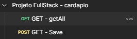
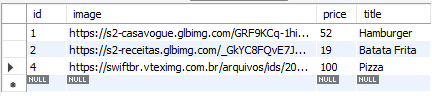

# Cardápio Online - Projeto de API BackEnd

O Cardápio Online é parte de um projeto Full Stack desenvolvido para fins de estudo e prática, com o objetivo de testar a integração entre uma API back-end e uma interface gráfica front-end.

[Para Acessar o Cardápio Front-End Clique Aqui](https://github.com/JeffSSousa/cardapio-frontend-react-typescript)

O projeto tem como foco o aprendizado de comunicação entre sistemas, desde o desenvolvimento e exposição de endpoints no back-end até o consumo e exibição de dados no front-end.

## ✨ Principais Funções do Projeto

- Insegir Produtos no Cardápio
- Listar todos os Produtos do Cardápio

## 🚀 Tecnologias Utilizadas
- **Java 21** - linguagem principal do projeto.
- **Spring Boot** - framework para construção da API REST.
- **Spring Data JPA** - persistência de dados e integração com o banco.
- **MySQL** – banco de dados relacional utilizado.
- **Lombok** - biblioteca para reduzir código boilerplate.
- **Maven** – gerenciamento de dependências e build do projeto.
- **Postman** – teste e documentação dos endpoints da API. 

## ✅ Exemplo de Requisição Realizada no Postman


## ✅ Exemplo da Tabela de Foods no Banco de Dados MySQL


## Como Rodar o Projeto

⚙️ Pré-requisito.
- [MySQL](https://dev.mysql.com/downloads/) instalado.

1. **Faça o Fork do Projeto e Baixe no seu Computador**.

2. **Baixe e instale o MySQL**

   Caso ainda não tenha instalado, baixe em [MySQL Downloads](https://dev.mysql.com/downloads/).

3. **Crie o banco de dados no MySQL**

   ```sql
   CREATE DATABASE foods;

4. **Configure o aplication.properties para usar o seu acesso do MySQL**
   ```file
   spring.datasource.url=jdbc:mysql://localhost:3306/foods
   spring.datasource.username= SEU USUARIO
   spring.datasource.password= SUA SENHA

5. **Execute o Projeto como aplicação spring boot**

   Na IDE, clique para rodar como Spring Boot Application ou utilize o comando abaixo no terminal:

   ```bash
   ./mvnw spring-boot:run

6. Agora faça o fork do [Cardápio Front-End](https://github.com/JeffSSousa/cardapio-frontend-react-typescript) e siga as instruções para executar ele, lembrando que os dois devem estar sendo executados ao mesmo tempo.


<br><br>

## 🙋 Sobre o Autor

### Desenvolvido por Jefferson Sousa  
[GitHub](https://github.com/JeffSSousa) | [LinkedIn](https://www.linkedin.com/in/jefferson-sousa-8b93a81a2/)